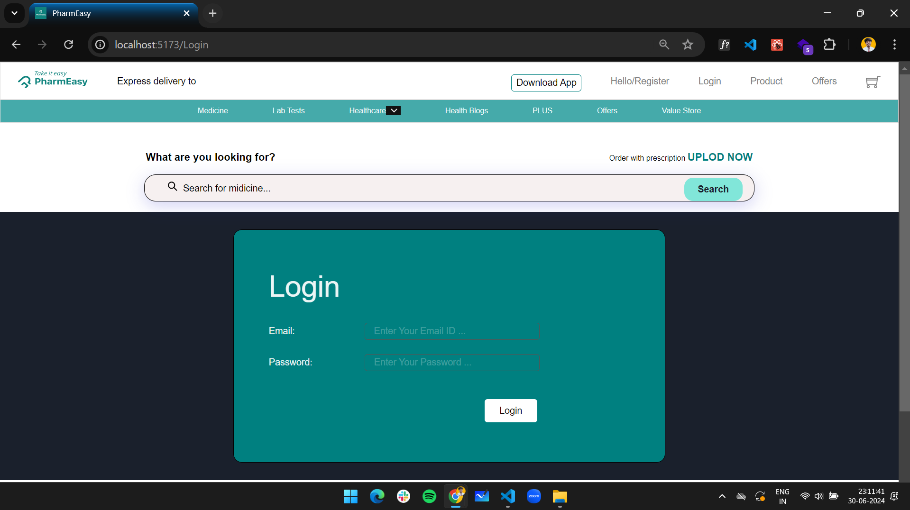
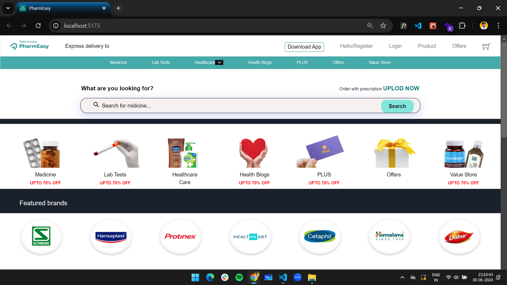

# PharmEasy Clone

This project is a clone of the PharmEasy website built using React, Vite, and Chakra UI.

## Features

- **Login and Logout Functionality:** Users can authenticate using a basic login form.

- **Navigation:** Implemented with React Router for seamless navigation between pages.

## Technologies Used

- **React**: Frontend library for building user interfaces.
- **Vite**: Fast, modern build tool that optimizes the frontend development experience.
- **Chakra UI**: Component library for building responsive and accessible UIs.
- **React Router**: Declarative routing for React applications.

## Links

- **Website Link:** [PharmEasy Clone](https://pharm-easy-4-march-2024-56l3.vercel.app/)
- **GitHub Repository:** [PharmEasy Clone on GitHub](https://github.com/susheelvishwa/PharmEasy)
